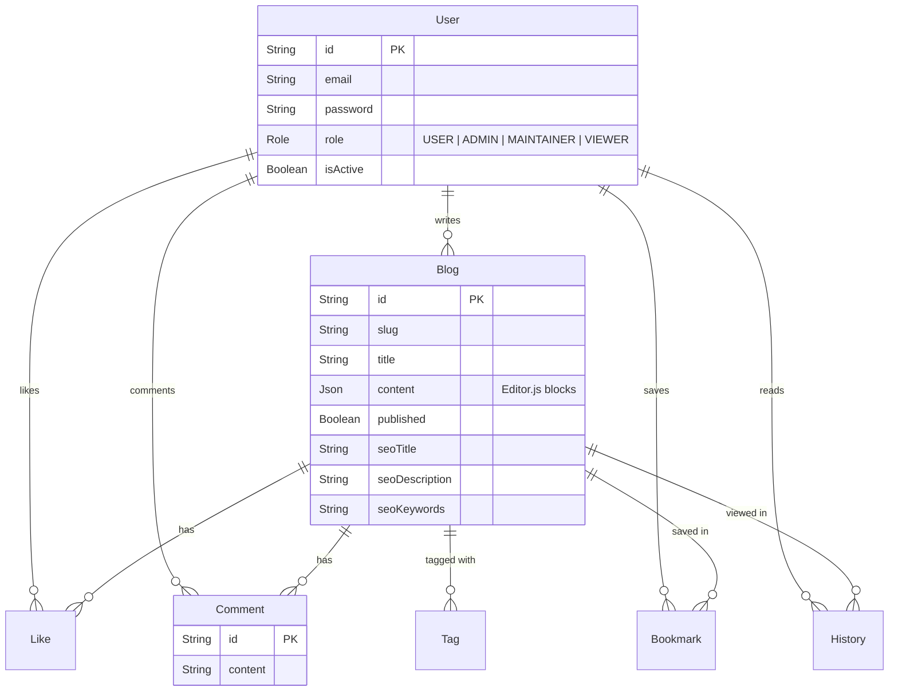
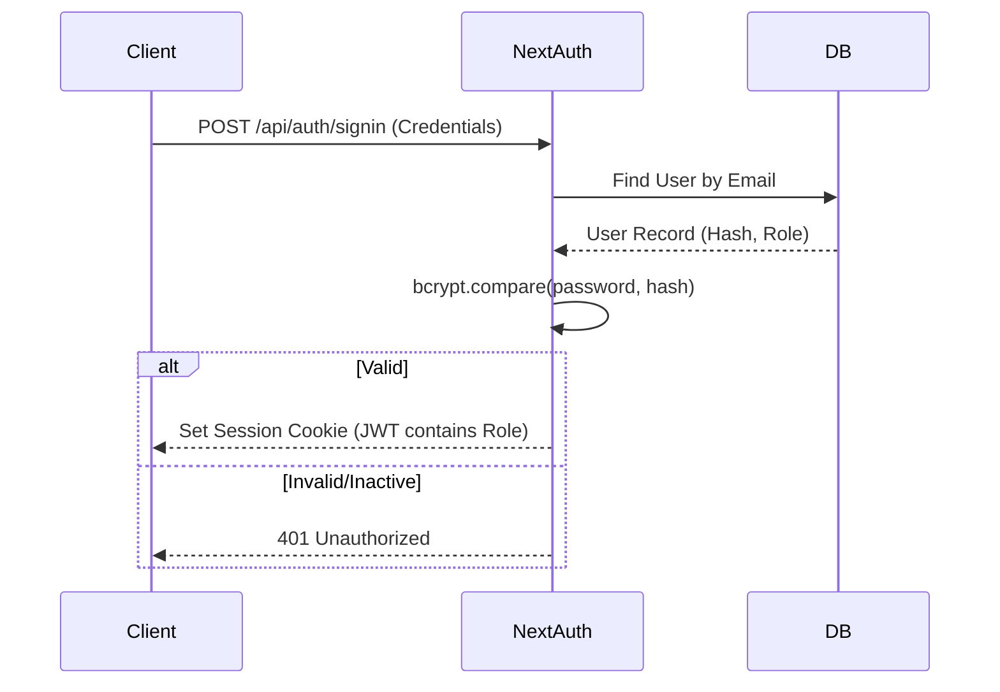
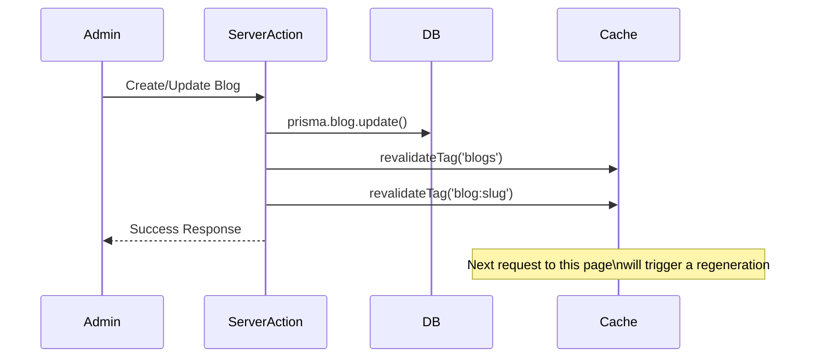

# 📘 Lumina Technical Documentation

This document provides a deep dive into the technical architecture, data flow, and design decisions behind **Lumina**, a production-ready blogging platform built with Next.js 15.

---

## 1. System Architecture

Lumina follows a **Monolithic Architecture** leveraging the **Next.js App Router** full-stack capabilities. It combines Server Components for performance/SEO and Client Components for interactivity.

### High-Level Design

```mermaid
graph TD
    User[User Client] -->|HTTPS| CDN[Edge Network / Vercel]
    CDN -->|Cache Hit| CachedPage[Static Page (ISR)]
    CDN -->|Cache Miss| Server[Next.js Server]
    
    subgraph "Next.js Application"
        Server -->|Auth| NextAuth[NextAuth.js v5]
        Server -->|Data Fetching| Prisma[Prisma ORM]
        Server -->|Revalidation| Cache[Data Cache]
    end
    
    Prisma -->|Query| DB[(PostgreSQL)]
```

---

## 2. Database Schema (Prisma)

The database is normalized to support role-based access, content tagging, and social interactions.



---

## 3. Critical Flows

### 3.1 Authentication & Authorization (RBAC)
We use **NextAuth.js v5** with a Credentials provider.

*   **Login:** Email/Password verified via `bcrypt`.
*   **Session Strategy:** JWT (Stateless).
*   **Role Attachment:** User Role is fetched on login and attached to the JWT token. Middleware and API routes check this token for `ADMIN` privileges.



### 3.2 Blog Creation & Revalidation (ISR)
Lumina uses **Incremental Static Regeneration (ISR)** to serve static HTML that updates instantly when needed.



### 3.3 Rich Text & SEO Handling
Instead of storing HTML, we store **Structured JSON** generated by `Editor.js`.

*   **Storage:** JSON (Blocks: Paragraph, Header, List, Image, Quote, Code).
*   **Rendering:** `BlogContent.tsx` iterates these blocks and renders high-contrast typography, properly styled code snippets, and responsive media containers.
*   **SEO Layer:** Authors configure `seoTitle`, `seoDescription`, and `seoKeywords` in an always-visible SEO tray (with character counts and live preview). Values flow through Prisma → API → `generateMetadata` and JSON-LD so every blog detail page includes canonical URLs and `BlogPosting` schema.
*   **Benefit:** Allows easy restyling of content later without parsing HTML strings and safer against XSS.

---

## 4. Key Technical Decisions

### ⚡ Next.js 15 & App Router
*   **Why:** Server Components allow us to fetch data directly from the DB without an API layer for reading, significantly reducing latency and bundle size.
*   **Optimization:** We use `revalidateTag` for precise cache invalidation instead of time-based revalidation alone.

### 🎨 Styling System
*   **Tailwind CSS v4:** chosen for atomic utility classes.
*   **Design Tokens:** Defined in `globals.css` (e.g., `--font-serif` for Merriweather).
*   **Performance:** Zero runtime CSS overhead.

### 🖼️ Image Optimization
*   **`next/image`:** Used universally.
*   **Why:** Automatically generates modern formats (WebP/AVIF), prevents **Cumulative Layout Shift (CLS)** by enforcing aspect ratios, and handles lazy loading.

---

## 5. Security Architecture

### 🛡️ Layered Defense
1.  **Transport Layer:** All data in transit is encrypted via HTTPS (enforced by Vercel/Production Env).
2.  **Input Validation:** **Zod** schemas validate all API inputs (`createBlogSchema`, `registerSchema`) before hitting the database.
3.  **XSS Prevention:** 
    *   React escapes content by default.
    *   Editor.js stores JSON, not HTML.
    *   Rich text rendering in `BlogContent.tsx` uses a whitelist approach (rendering specific blocks) rather than `dangerouslySetInnerHTML` on arbitrary strings.
4.  **Auth Boundaries:** 
    *   API Routes check `session.user`.
    *   Role middleware (`isAdmin`) ensures strictly authorized mutations.

---

## 6. Performance Optimization Strategy

### 🚀 Core Web Vitals Focus
*   **LCP (Largest Contentful Paint):** 
    *   Hero images use `priority` prop.
    *   Fonts (`Inter`, `Merriweather`) are self-hosted via `next/font` to avoid layout shifts.
*   **CLS (Cumulative Layout Shift):** 
    *   All images have explicit `width`/`height` or `aspect-ratio` via `next/image` container divs.
    *   Skeleton loaders used during `loading.tsx` states.
*   **INP (Interaction to Next Paint):**
    *   Heavy JS (like `Editor.js`) is lazy-loaded only on Admin pages.
    *   Client Components are kept small; majority of code stays on Server.

---

## 7. API Reference (Internal)

All public data fetching is done via Server Components. API routes are primarily for mutations (POST/PUT/DELETE) and client-side interactions.

| Method | Endpoint | Description | Access |
| :--- | :--- | :--- | :--- |
| `GET` | `/api/blogs` | List blogs (paginated) | Public |
| `POST` | `/api/blogs` | Create a new blog | Auth Required |
| `POST` | `/api/likes` | Toggle like on a blog | Auth Required |
| `POST` | `/api/history` | Record page visit | Auth Required (Silent) |
| `DELETE`| `/api/comments/[id]` | Delete comment | Author / Admin / Blog Owner |

---

## 8. Deployment & Scalability

### ☁️ Infrastructure
*   **Frontend/API:** Vercel (Serverless Functions).
*   **Database:** PostgreSQL. Connection is driven via `DATABASE_URL`. For local development you can still point to Docker Postgres.
*   **Media:** Currently Base64 (Proof of Concept). *Recommendation for Scale:* Switch `Editor.js` image uploader to use AWS S3 / Cloudinary to keep DB lean.

### 📈 Scaling Strategy
1.  **Vertical:** Upgrade DB instance size.
2.  **Horizontal:** Next.js Serverless functions scale automatically.
3.  **Read Replicas:** Prisma supports read-replicas for high-traffic read operations.

---

## 9. Folder Structure

```
app/
├── (public)/          # Publicly accessible routes (Home, Blog, Library)
│   ├── blog/[slug]/   # ISR: Blog Detail Page
│   └── library/       # CSR: User's Saved/History
├── sitemap.ts         # Dynamic sitemap (blogs, tags)
├── robots.ts          # Crawl directives pointing to sitemap
├── (admin)/           # Protected Admin Routes
│   └── admin/         # Dashboard, Editor
├── api/               # API Route Handlers (Mutations)
├── components/        # Reusable UI Components
│   └── __tests__/     # Component Tests
└── lib/               # Utilities (DB, Auth, Fetch Wrapper)
    └── __tests__/     # Logic Tests
```
